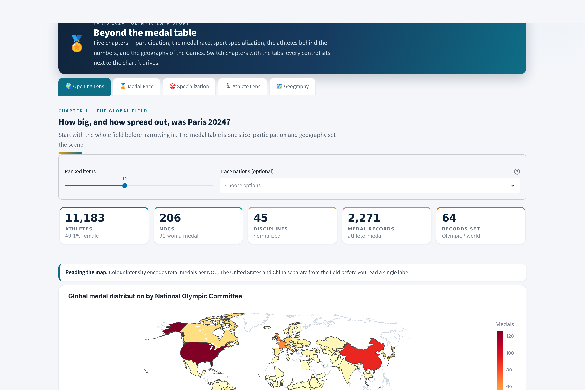
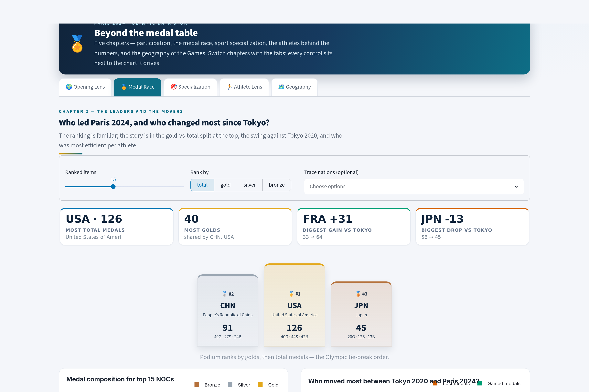
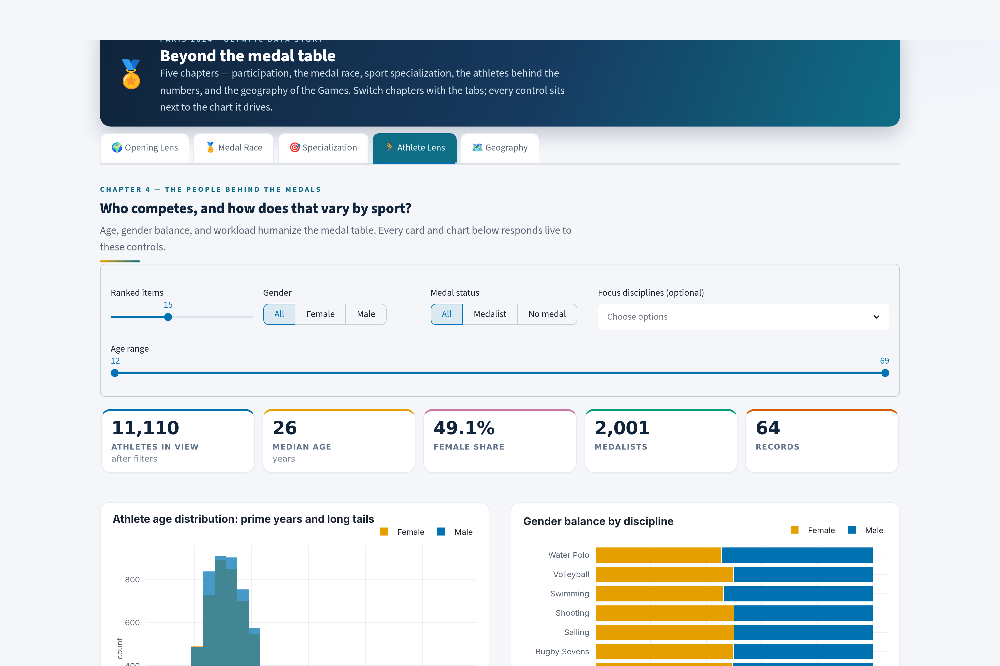

# Paris 2024 Olympic Data Story

Streamlit dashboard and report materials for the IT5425 Data Management and Visualization capstone project.

The dashboard is designed as a **data story, not a data dump**. Navigation is
inline **tabs** and every control sits in the page next to the chart it drives, so
you interact with the data directly. Each chapter leads with animated **headline
KPI cards**, shows the data visually in dense multi-column grids, and keeps detail
on demand in tooltips (no raw tables). Colour is the colourblind-safe Okabe–Ito palette, used only to
carry meaning. Design cues are drawn from *The Big Book of Dashboards* (Wexler,
Shaffer, Cotgreave).



| Medal Race (podium, no table) | Athlete Lens (live KPIs) |
| --- | --- |
|  |  |

(See `docs/screenshots/` for all five sections.)

## What This Project Does

The dashboard analyzes the Paris 2024 Olympic Games through five linked story sections:

1. **Opening Lens** - global scale, medal geography, delegation size vs medal output.
2. **Medal Race** - leader/movers KPIs, a gold-silver-bronze podium, Paris-vs-Tokyo change, and a day-by-day medal timeline with an animated cumulative race.
3. **Sport Specialization** - discipline medal volume, country-discipline heatmap, treemap, and a derived medal-flow graph.
4. **Athlete Lens** - age distributions, gender balance, discipline age profiles, and competition workload.
5. **Paris Geography** - venue map, competition rhythm, busiest venues, and record-setting disciplines.

The project follows `course_requirements/course_info.md` as the source of truth: Streamlit is used as the dashboard tool, the dataset is findable on Google Dataset Search, and the report analyzes how course visualization techniques are applied.

## Project Structure

```text
.
|-- app.py
|-- course_requirements/      # teacher requirements + course-content reference
|   |-- course_info.md        # source of truth (teacher's brief)
|   `-- chapter_reference.md  # course chapters expanded into design checkpoints
|-- report_and_slides/        # graded write-ups (report + deck)
|   |-- report.tex        -> report.pdf
|   `-- presentation.tex  -> presentation.pdf
|-- dataset_info.md
|-- scripts/
|   `-- make_figures.py   # regenerates every figure (PDF + PNG)
|-- figures/              # vector PDF + high-DPI PNG figures (shared by report + deck)
|-- docs/screenshots/     # live-app screenshots (all 5 sections)
|-- requirements.txt
|-- USAGE.md
|-- VERIFICATION_REPORT.md
|-- data/
|   |-- athletes.csv
|   |-- athletes_disciplines.csv
|   |-- athletes_events.csv
|   |-- medal_countries.csv
|   |-- medal_countries_tokyo.csv
|   |-- medallists.csv
|   |-- medals.csv
|   `-- paris2024_athletes_enriched.csv
|-- src/
|   |-- data_loader.py
|   |-- data_processing.py
|   |-- utils.py
|   `-- visualizations.py
`-- .streamlit/
    `-- config.toml
```

## Data Sources

- Official Paris 2024 CSVs — Kaggle "Paris 2024 Olympic Summer Games" (findable on Google Dataset Search): https://www.kaggle.com/datasets/piterfm/paris-2024-olympic-summer-games
- Enriched athlete table — data.gouv.fr "Les athlètes des Jeux Olympiques de Paris 2024" (findable on Google Dataset Search): https://www.data.gouv.fr/datasets/les-athletes-des-jeux-olympiques-de-paris-2024
- Google Dataset Search: https://datasetsearch.research.google.com (queries: "Paris 2024 Olympic Summer Games"; "Les athlètes des Jeux Olympiques de Paris 2024")
- Dev mirror only (not a cited source, not GDS-indexed): https://github.com/taniki/paris2024-data

See `dataset_info.md` for schema, row counts, quality notes, and refresh commands.

## Run Command

```bash
conda activate mpg          # Python 3.11 env with streamlit/pandas/plotly/kaleido
streamlit run app.py
```

Full, exact setup, run, figure-export, and compile instructions are in `USAGE.md`.

## Figures

Every report figure is regenerated from the same prepared data and chart
builders the app uses, with one command:

```bash
python scripts/make_figures.py   # 17 figures -> figures/*.pdf + figures/*.png
```

## Report and Slides

The report and presentation are LaTeX sources, compiled with `tectonic`
(installed via conda; no root needed). Both are written from scratch and build
clean, embedding the vector figures from `scripts/make_figures.py`:

```bash
cd report_and_slides
tectonic report.tex          # -> report.pdf (21 pages)
tectonic presentation.tex    # -> presentation.pdf (14 slides)
```

The design uses a charcoal / gold / teal / coral palette.

## Verification Done

The dashboard was run and driven end-to-end (the earlier "no local testing"
constraint is lifted). See `VERIFICATION_REPORT.md` for details:

- Headless Streamlit server starts clean (HTTP 200, no tracebacks).
- All 5 sections and every inline filter driven via Streamlit `AppTest`,
  including empty/narrow stress cases — **0 exceptions**.
- Data row counts, dtypes, and missing-value rates validated against the docs.
- All 19 chart builders render with real data; 17 export to PDF/PNG.
- `report.pdf` and `presentation.pdf` both compile and embed the vector figures.

## Deliverables

- Dashboard source: `app.py`, `src/`
- Figure pipeline: `scripts/make_figures.py`
- Dataset: `data/` (documentation in `dataset_info.md`)
- Usage / verification: `USAGE.md`, `VERIFICATION_REPORT.md`
- Report: `report_and_slides/report.tex` → `report_and_slides/report.pdf`
- Presentation: `report_and_slides/presentation.tex` → `report_and_slides/presentation.pdf`
- Figure assets: `figures/` (vector PDF + PNG)
- Course requirements: `course_requirements/` (`course_info.md`, `chapter_reference.md`)
